# Database Relationships & Integration Strategy

This document outlines the entity relationships, cascade deletion rules, Redis caching topologies, and vector database synchronization pipelines for the AI Fashion Assistant Platform.

---

## 1. Entity Relationship Diagram (ERD)

The following Mermaid diagram visualizes the primary tables across all microservices, showing their keys and relationships.

```mermaid
erDiagram
    %% User Service
    USERS {
        uuid id PK
        varchar email UK
        varchar phone UK
        varchar auth_provider
        varchar password_hash
        boolean is_active
        timestamp created_at
    }
    USER_PROFILES {
        uuid user_id PK, FK
        varchar first_name
        varchar last_name
        numeric height_cm
        numeric weight_kg
        varchar body_type
        varchar skin_tone
        varchar gender
        date dob
    }
    USER_PREFERENCES {
        uuid user_id PK, FK
        varchar_array style_tags
        varchar_array disliked_colors
        budget_band_type budget_band
        varchar size_top
        varchar size_bottom
        varchar size_shoes
    }

    %% Wardrobe Service
    WARDROBE_ITEMS {
        uuid id PK
        uuid user_id FK
        varchar category
        varchar subcategory
        varchar primary_color
        varchar_array secondary_colors
        varchar pattern
        varchar fit
        integer formality
        varchar_array seasons
        text image_url
        text thumb_url
        source_type source
        processing_status processing_status
        timestamp created_at
    }
    ITEM_ATTRIBUTES {
        uuid id PK
        uuid item_id FK
        varchar key
        varchar value
        numeric confidence
    }
    ITEM_TAGS {
        uuid id PK
        uuid item_id FK
        varchar tag
    }

    %% Outfit Service
    OUTFITS {
        uuid id PK
        uuid user_id FK
        jsonb context_json
        text reasoning_text
        numeric score
        timestamp created_at
    }
    OUTFIT_ITEMS {
        uuid id PK
        uuid outfit_id FK
        uuid item_id FK
        outfit_role role
    }
    SAVED_OUTFITS {
        uuid user_id PK, FK
        uuid outfit_id PK, FK
        timestamp saved_at
    }
    GAP_ANALYSIS_RESULTS {
        uuid id PK
        uuid user_id FK
        text missing_item_description
        integer unlocked_outfit_count
        numeric versatility_score
        uuid_array suggested_product_ids
        timestamp computed_at
        timestamp expires_at
    }

    %% Feed Service
    FEED_CARDS {
        uuid id PK
        varchar title
        text description
        text model_image_url
        varchar_array style_tags
        varchar source
        timestamp created_at
    }
    FEED_CARD_ITEMS {
        uuid id PK
        uuid card_id FK
        varchar product_title
        varchar brand
        outfit_role role
        numeric x_coord
        numeric y_coord
        text external_product_url
    }
    USER_FEED_INTERACTIONS {
        uuid id PK
        uuid user_id FK
        uuid card_id FK
        feed_interaction_action action
    }

    %% Commerce Service
    EXTERNAL_PRODUCTS {
        uuid id PK
        varchar source
        varchar source_id
        varchar title
        varchar brand
        text image_url
        numeric price
        varchar currency
        text url
    }
    AFFILIATE_LINKS {
        uuid id PK
        uuid product_id FK
        varchar network
        text tracking_url
        boolean is_active
    }
    PURCHASE_CLICKS {
        uuid id PK
        uuid user_id FK
        uuid product_id FK
        uuid outfit_id FK
        varchar referrer_context
        timestamp clicked_at
    }

    %% Relationships Mapping
    USERS ||--|| USER_PROFILES : "has profile"
    USERS ||--|| USER_PREFERENCES : "defines preferences"
    USERS ||--o{ WARDROBE_ITEMS : "owns items"
    USERS ||--o{ OUTFITS : "receives suggests"
    USERS ||--o{ SAVED_OUTFITS : "saves"
    USERS ||--o{ USER_FEED_INTERACTIONS : "interacts with feed"
    USERS ||--o{ PURCHASE_CLICKS : "clicks external links"
    USERS ||--o{ GAP_ANALYSIS_RESULTS : "gets gap insights"

    WARDROBE_ITEMS ||--o{ ITEM_ATTRIBUTES : "extracted to"
    WARDROBE_ITEMS ||--o{ ITEM_TAGS : "user-tagged as"
    WARDROBE_ITEMS ||--o{ OUTFIT_ITEMS : "included in"

    OUTFITS ||--o{ OUTFIT_ITEMS : "comprises"
    OUTFITS ||--o{ SAVED_OUTFITS : "saved in"
    OUTFITS ||--o{ PURCHASE_CLICKS : "linked from click"

    FEED_CARDS ||--o{ FEED_CARD_ITEMS : "tagged with hotspots"
    FEED_CARDS ||--o{ USER_FEED_INTERACTIONS : "evaluated on feed"

    EXTERNAL_PRODUCTS ||--o{ AFFILIATE_LINKS : "monetized by"
    EXTERNAL_PRODUCTS ||--o{ PURCHASE_CLICKS : "target of click"
```



---

## 2. Cascade & Deletion Policies

Strict foreign key constraints ensure high data integrity, preventing orphaned rows in downstream services when active entities are deleted.

| Parent Table | Child Table | Foreign Key Column | Deletion Action | Rationale |
|---|---|---|---|---|
| `users` | `user_profiles` | `user_id` | `CASCADE` | Purges personal profile when account is closed. |
| `users` | `user_preferences` | `user_id` | `CASCADE` | Clears search and styling filters. |
| `users` | `wardrobe_items` | `user_id` | `CASCADE` | Wardrobe photos are user-owned; cascading delete cleans storage. |
| `users` | `purchase_clicks` | `user_id` | `SET NULL` | Preserves click records for affiliate monetization analytics. |
| `wardrobe_items`| `item_attributes`| `item_id` | `CASCADE` | Vision ML metadata has no meaning without the garment photo. |
| `wardrobe_items`| `item_tags` | `item_id` | `CASCADE` | User-defined tags deleted with item. |
| `wardrobe_items`| `outfit_items` | `item_id` | `CASCADE` | Outfits containing deleted items are automatically adjusted/purged. |
| `outfits` | `outfit_items` | `outfit_id` | `CASCADE` | Deletes structural outfit elements when the outfit combination record is deleted. |
| `outfits` | `saved_outfits` | `outfit_id` | `CASCADE` | Cleans up bookmark table when suggestions expire. |
| `feed_cards` | `feed_card_items` | `card_id` | `CASCADE` | Hotspots are physically bound to the model template image. |
| `external_products`| `affiliate_links`| `product_id`| `CASCADE` | Affiliate redirect templates removed if target catalog item is scrubbed. |

---

## 3. Caching Strategy (Redis Key Schema)

Caching reduces heavy joins on user wardrobe lookups and limits costly repetitive calls to Python recommender services.

### 3.1 Caching Patterns & TTLs
*   **Wardrobe Cache:** Caches the full JSON listing of a user's verified items.
    *   *Key:* `wardrobe:{user_id}`
    *   *Data Type:* String (Gzipped JSON) or Hash (per item_id)
    *   *TTL:* 300 seconds (5 minutes)
    *   *Invalidation:* Evicted immediately on `item.uploaded`, `item.deleted`, or `item.attributes_corrected` event.
*   **User Style Profile Cache:**
    *   *Key:* `user_profile:{user_id}`
    *   *TTL:* 3600 seconds (1 hour)
    *   *Invalidation:* Evicted on `user.profile_updated` and `user.preferences_changed`.
*   **Outfit Generation Cache:** Caches recommendations generated under a unique context.
    *   *Key:* `outfit_suggestions:{user_id}:{md5_context_hash}`
    *   *TTL:* 3600 seconds (1 hour)
    *   *Invalidation:* Not actively invalidated (allowed to naturally expire).
*   **Gap Analysis Cache:** Caches nightly combinatorial calculation values.
    *   *Key:* `gap_analysis:{user_id}`
    *   *TTL:* 86400 seconds (24 hours)
    *   *Invalidation:* Evicted on `item.uploaded` (as adding physical items changes wardrobe gaps).

---

## 4. Vector Database Synchronization Mapping

To enable sub-second candidate generation, the Recommender service relies on a Vector DB (Pinecone/Qdrant) running parallel to PostgreSQL.

### 4.1 Index Topology
The platform maintains a dual-index architecture:
1.  **`item_embeddings` (Personal Index):**
    *   **Dimension:** 512 (CLIP ViT-B/32 image encoder).
    *   **Namespace:** Isolation per user via `user_{user_id}` namespace.
    *   **Vector Payload Metadata:**
        ```json
        {
          "item_id": "uuid-v4-string",
          "category": "Tops",
          "subcategory": "Sweaters & Cardigans",
          "primary_color": "#2C3E50",
          "formality": 6
        }
        ```
2.  **`style_embeddings` (Global Index):**
    *   **Dimension:** 512 (CLIP text/image joint representation).
    *   **Namespace:** Global namespace `editorial_inspiration`.
    *   **Vector Payload Metadata:**
        ```json
        {
          "card_id": "uuid-v4-string",
          "style_tags": ["streetwear", "minimalist"]
        }
        ```

### 4.2 Sync Flow & Pipeline
The vector store sync is strictly **event-driven** and decoupled from the synchronous HTTP request-response lifecycle:

```
[User App] ──(Upload Image)──> [Wardrobe Service]
                                       │
                                (Postgres Save: processing_status='pending')
                                       │
                                 [Kafka Event: item.uploaded]
                                       │
                                       ▼
                                [Vision Service]
                                       │
                        1. Background removal & Crop
                        2. Classification attributes
                        3. Generate 512-d CLIP Embedding
                                       │
                                       ├─(gRPC Update Status='processed')─> [Wardrobe Service]
                                       │
                                       └─(Upsert Vector Namespace: user_id)──> [Vector DB]
```

*   **Create/Update Sync:** When `Vision Service` completes processing an item, it writes attributes back to PostgreSQL and calls `upsert` directly on the Vector DB.
*   **Delete Sync:** When a user deletes a wardrobe item, `Wardrobe Service` removes it from Postgres and publishes `item.deleted` to Kafka. The `Vision/Embedding Service` consumes this event and executes a vector delete:
    *   *Vector API command:* `db.index("item_embeddings").namespace("user_{user_id}").delete(ids=["{item_id}"])`
